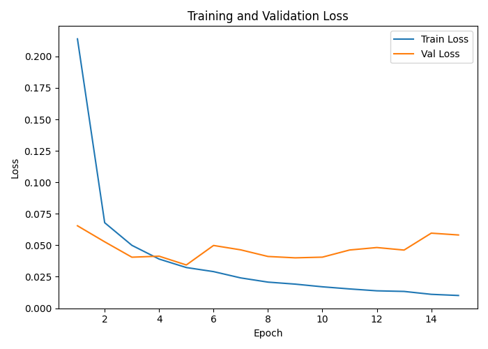
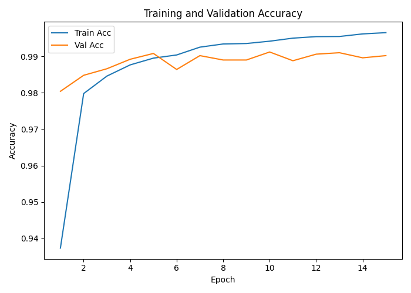
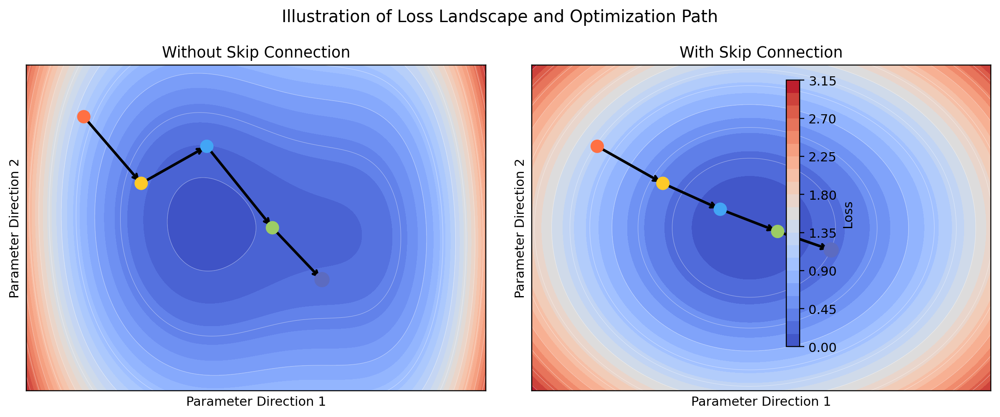
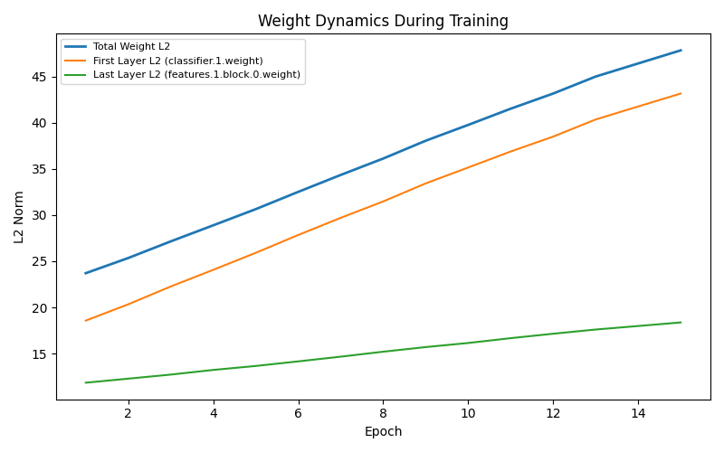

# 基于卷积神经网络的 MNIST 手写数字识别实验报告

## 1. 实验目的

本实验旨在基于 PyTorch 构建卷积神经网络（CNN），完成 MNIST 手写数字识别任务，并结合多种训练优化方法分析其对模型优化能力与泛化能力的影响。

通过本实验，希望进一步理解以下内容：

1. 卷积神经网络在图像任务中的基本原理；
2. CNN 相比 MLP 的优势；
3. 优化器、正则化、归一化、初始化和数据增强等方法的作用；
4. 图像分类模型训练、测试与推理的完整流程；
5. 不同实验设置对模型性能的影响。

---

## 2. 理论基础

### 2.1 从 MLP 到 CNN

### 2.2 卷积层与池化层

### 2.3 激活函数与非线性表达

### 2.4 损失函数与优化器

### 2.5 正则化与泛化能力

---

## 3. 数据集与预处理

### 3.1 MNIST 数据集介绍

### 3.2 数据归一化方法

### 3.3 数据增强策略

---

## 4. 模型设计

### 4.1 MLP 基线模型

### 4.2 基础 CNN 模型

### 4.3 改进 CNN 模型

---

## 5. 实验设置

### 5.1 训练环境

### 5.2 超参数配置

### 5.3 对比实验设计

---

## 6. 实验结果

### 6.1 训练损失曲线

以下给出了当前最优实验对应的训练损失曲线。可以看到，随着训练轮数增加，训练集损失持续下降，验证集损失在前期快速下降后逐渐趋于稳定，说明模型已经基本收敛。

从曲线可以看出，基础 CNN 在 MNIST 任务上具有较强的拟合能力。训练后期训练损失仍在下降，而验证损失波动略有增大，说明模型在高精度阶段已经接近轻微过拟合边界，但整体泛化仍然稳定。

### 6.2 测试准确率对比

不同实验配置的最佳验证准确率对比如下：

| 实验名称 | 主要改动 | Epochs | 最佳验证准确率 |
|---|---|---:|---:|
| mlp_baseline | MLP 基线 | 10 | 0.9786 |
| cnn_basic | MLP → CNN | 10 | 0.9918 |
| cnn_bn_adamw | CNN + BatchNorm + AdamW | 10 | 0.9890 |
| cnn_aug | CNN + Data Augmentation | 10 | 0.9910 |
| cnn_reg | CNN + Dropout + Weight Decay | 10 | 0.9902 |
| cnn_aug_tuned | 调整 lr / weight decay / dropout 的增强实验 | 10 | 0.9890 |
| cnn_basic_long | 基础 CNN 延长训练 | 15 | 0.9924 |
| cnn_skip | CNN + Skip Connection | 10 | 0.9910 |
| cnn_skip_long | CNN + Skip Connection 延长训练 | 15 | 0.9916 |

进一步观察当前最优实验的准确率变化曲线，可以看到训练准确率和验证准确率整体同步上升，并在后期稳定在较高水平。

在测试集上的最终评估结果如下：

- Test Loss: 0.0344
- Test Accuracy: 0.9928

结果说明，`cnn_basic_long` 不仅在验证集上表现最好，也在独立测试集上保持了稳定且较高的分类性能。

### 6.3 推理样本展示

在完成训练与测试集评估后，本文进一步使用当前最优模型 `cnn_basic_long` 对单张 MNIST 图片进行了推理验证。推理脚本能够加载指定配置与 checkpoint，对输入图片完成预处理、前向计算和类别预测，并将预测结果保存到 `outputs/predictions/` 目录中。至此，项目已经完成训练、评估和推理三条主要链路。

---

## 7. 分析与讨论

### 7.1 CNN 相比 MLP 的提升原因

在相同训练轮数下，`mlp_baseline` 的最佳验证准确率为 `0.9786`，而 `cnn_basic` 达到 `0.9918`。这一结果表明，相比 MLP，CNN 更适合处理 MNIST 这类二维图像数据。

主要原因在于，MLP 会先将图像直接展平，破坏像素之间的空间结构；而 CNN 通过卷积核能够保留局部邻域关系，更有效地提取边缘、笔画和局部形状等特征。此外，参数共享机制使 CNN 在图像任务中具有更强的表示能力和更好的参数效率，因此能够取得更高精度。

### 7.2 各优化方法的作用分析

从整体实验结果看，模型结构从 `MLP` 转换到 `CNN` 是性能提升最显著的一步；而后续引入 `BatchNorm`、`AdamW`、`Dropout`、`Weight Decay`、`Data Augmentation` 和 `Skip Connection` 等方法后，并未在当前任务设置下超过 `cnn_basic_long`。

其中，`Dropout + Weight Decay` 的正则化实验优于 `cnn_bn_adamw`，说明适度正则化对泛化能力有一定帮助；`Data Augmentation` 在修复预处理覆盖问题后，相比未修复前确实带来了提升；而 `BatchNorm + AdamW` 与 `Skip Connection` 在当前较浅网络和较简单任务上没有体现出明显优势。

为了更直观地说明 `Skip Connection` 的作用，本文绘制了一个损失地形与优化路径示意图。该图表达的是：加入跳连后，优化路径通常更平滑，模型更容易沿着较稳定的方向逼近较优解。

需要说明的是，这是一张用于报告解释的示意图，并非直接由本项目参数空间精确计算得到的真实高维损失面。但它能够较好地帮助理解为什么更深层网络常常需要 `Skip Connection` 来改善梯度传播和优化稳定性。

### 7.3 实验中的问题与改进方向

为了补充训练过程分析，本文还记录了当前最优实验中权重范数随训练轮数的变化情况。图中展示了总权重范数，以及首层和末层代表性权重的 `L2` 范数变化。

可以看到，随着训练推进，模型整体权重范数持续增大，而验证准确率在后期趋于稳定。这说明模型仍在不断调整参数幅值以拟合训练集，但验证集收益已经有限，因此后续可以考虑引入更细致的学习率调度或更强的正则化策略，以进一步缓解后期波动。

本实验过程中还出现过一个重要问题：在早期实现中，训练集与验证集共享同一底层数据集对象，导致为验证集设置的变换覆盖了训练集增强变换，使 `Data Augmentation` 实际没有生效。修复该问题后，增强实验结果得到了改善。这也说明，实验代码的正确性会直接影响对方法效果的判断。

未来可继续改进的方向包括：

- 更系统的学习率调度策略
- 更深层的残差结构
- 更丰富的数据增强方式
- 更复杂的正则化方法
- 更大规模或半监督数据实验

---

## 8. 总结

本项目以 MLP baseline 为起点，逐步构建并验证了基于 CNN 的手写数字识别模型。实验结果表明：

1. CNN 相比 MLP 在 MNIST 任务上具有明显优势；
2. 在当前实验条件下，模型结构改进带来的收益大于优化器和附加训练技巧带来的收益；
3. `cnn_basic_long` 是本项目的最优实验，其最佳验证准确率达到 **0.9924**，测试准确率达到 **0.9928**；
4. `BatchNorm`、`AdamW`、`Dropout`、`Weight Decay`、`Data Augmentation` 和 `Skip Connection` 等方法具有实验价值，但在当前浅层网络和任务规模下并未超过基础 CNN 长训练方案。

本项目已在统一实验框架下实现并验证了以下方法：

- CNN
- Adam / AdamW
- Dropout
- Weight Decay
- He Initialization
- BatchNorm
- Data Augmentation
- Skip Connection

同时，项目已经完成训练、评估和推理三条主要链路，并具备继续扩展更深层网络、更复杂正则化方法和更大规模实验的工程基础。
